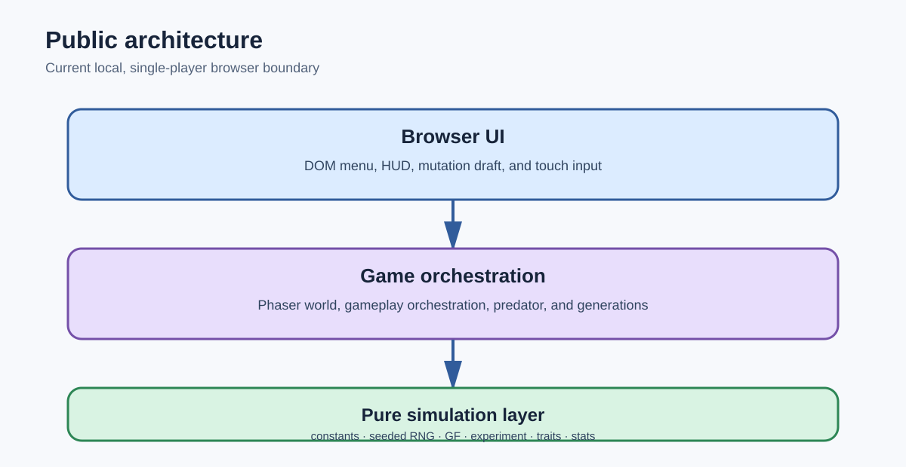
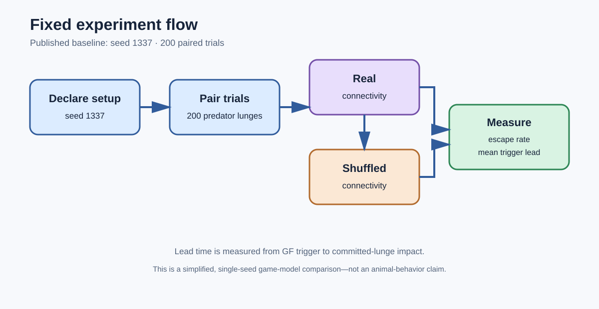
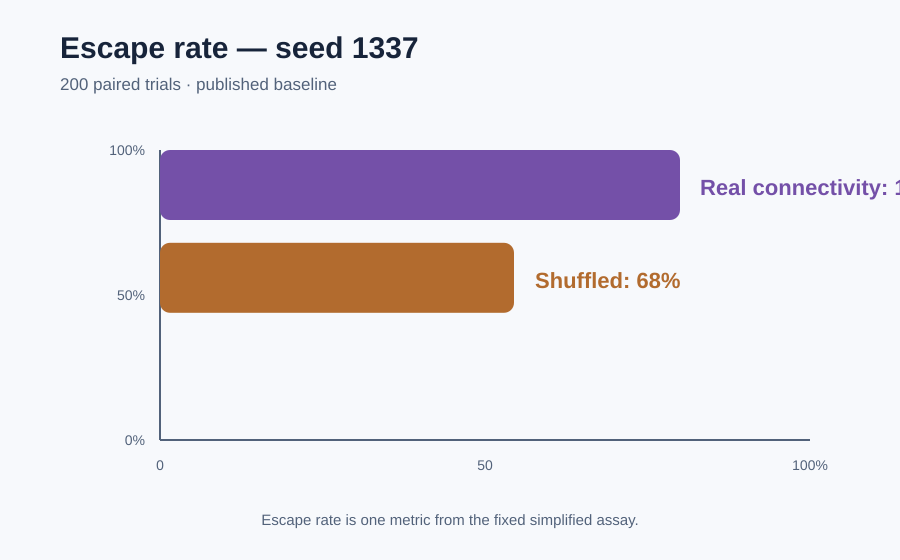
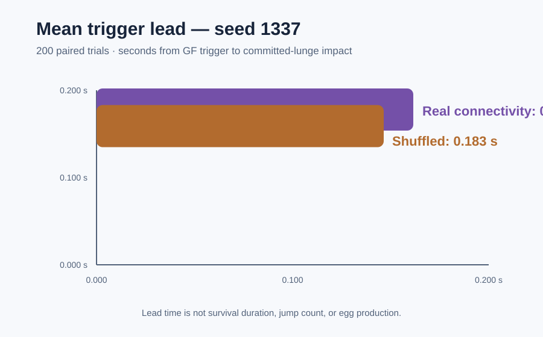

# Media

**Status: Not currently available**

## Authentic captures

There are currently no authorized real screenshots or video clips available for publication. This page does not substitute diagrams or prose for gameplay footage, and it does not claim that an image or video exists.

## Video walkthrough — coming soon

An authorized video walkthrough will be added when an authentic capture is available. No video URL is published yet.

## Text walkthrough

1. Open the browser game and enter a single-player run.
2. Move through the dish using keyboard, pointer, or touch controls to forage for sugar, yeast, and rot.
3. Manage energy while eggs are laid automatically and exposure to the approaching predator changes the immediate risk.
4. Watch the predator approach and commit to a trajectory. When the Giant Fiber (GF) response is **READY**, press Space or tap **GF ESCAPE**.
5. A successful escape can move the fly clear of the committed trajectory, while consuming energy and entering cooldown.
6. At the end of a generation, compare the lineage with the wild type and choose one mutation from a three-card draft.
7. Continue the lineage into the next generation.

This walkthrough describes the currently documented game loop; it is not a recording and should not be read as evidence of visual presentation.

## Public diagrams

The following self-contained diagrams summarize documented behavior and published experimental figures:

The experiment figures show only the published fixed baseline: seed `1337`, `200` paired trials, real connectivity at `100% / 0.202 s`, and shuffled connectivity at `68% / 0.183 s`. They are not screenshots of the game.
